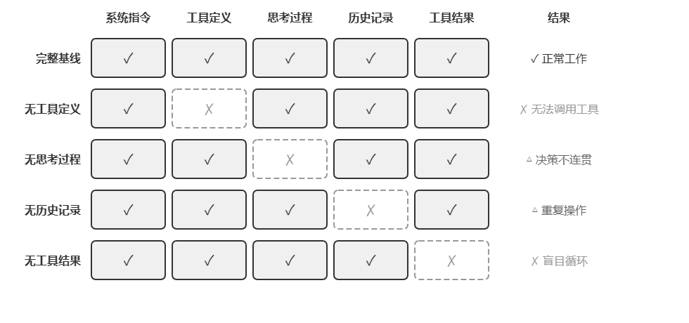
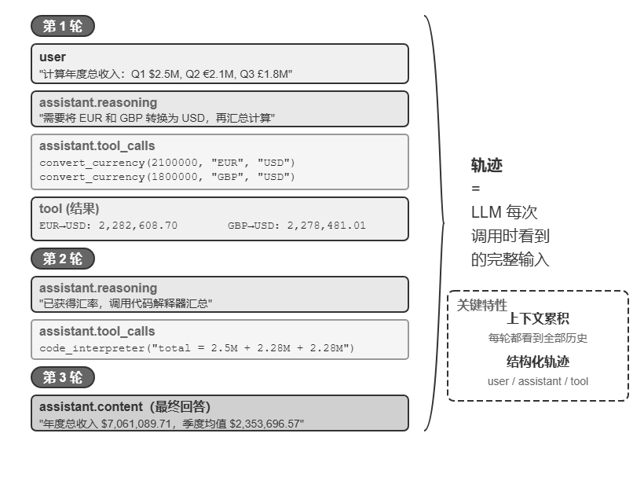
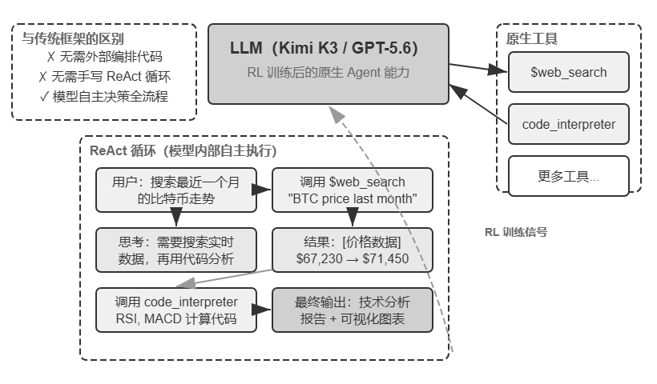

# notes

> 正文：[book/chapter1.md](../../../book/chapter1.md "book/chapter1.md") · 18,911 字 · 建议阅读 1.5 h

## 读之前我怎么想

读之前，我没有什么想法，对Agent的理解还存在基于ReAct架构的智能体，感知→决策→行动

Agent=LLM+工具+上下文+记忆

## 笔记整理

### 现代 Agent

现代 Agent 系统的本质可以用一个简洁的公式来表达：**Agent = LLM（大语言模型，Large Language Model）+ 上下文 + 工具**。

一种更直观的说法：**Agent = 大脑 + 眼睛 + 手脚**。大脑负责思考和决策，眼睛提供思考所需的全部信息，手脚将决策转化为对现实世界的改变。

| 直觉理解        | 实现组件  | 学术概念（可选）                         | 含义                                                 |
| ----------- | ----- | -------------------------------- | -------------------------------------------------- |
| \*\*大脑\*\*  | LLM   | \*\*策略\*\*（Policy）               | Agent 决定“下一步做什么”的决策逻辑——面对当前看到的信息，从所有可选行动中挑出最合适的一个  |
| \*\*眼睛\*\*  | 上下文   | \*\*观察空间\*\*（Observation Space）  | Agent 能看到的所有信息——能看到什么、读到什么、记住什么、能访问哪些系统            |
| \*\*手脚\*\*  | 工具    | \*\*动作空间\*\*（Action Space）       | Agent 能做的所有事情的集合——有哪些“手段”可用，从发消息到执行代码再到操控界面        |

#### 观察空间与动作空间：模型与世界的接口

简单来说，**观察空间与动作空间共同构成了 LLM 与外部环境之间的接口**。观察空间把环境中的信息转换为模型能够处理的上下文，动作空间则把模型的决策转换为对外部世界的操作。

因此，**在底层模型固定时，提升 Agent 任务表现最主要的系统工程手段，往往就是重新定义或扩展观察空间与动作空间**。

从目前的一些明星Agent产品看，我的感知，LLM肯定是越聪明越好，但是在单纯依赖LLM不能解决问题时，怎么扩大的动作空间、怎么更好的利用和优化观察空间，以及怎么更好的持续交互、协调，可能是agent架构能带给LLM的倍增器。而怎么触达用户，是能更好发挥产品价值的关键，从数据角度驱动agent迭代。

#### 工具：Agent 的手脚

工具是Agent与外部世界交互的桥梁，根据Agent与外界交互的方向，工具可以分为五类：

- **感知工具**让 Agent 能访问信息：搜索引擎提供实时网络数据，文件系统读取本地文档，API 和数据库则对接外部服务和企业核心数据。
- **执行工具**让 Agent 改变世界：代码执行、文件操作、系统命令、外部 API 调用——决策由此变成实际行动。
- **协作工具**让 Agent 与其他 Agent 分工合作：委托子 Agent 完成专项任务，在关键决策点请求人类确认，或在多 Agent 系统中协调行动。
- **事件触发工具**与前三类在调用方式上有本质的区别——它们不是 Agent 主动调用的，而是作为外部输入来驱动 Agent 开始执行任务。比如收到一封新邮件、到了某个预定时间点、或另一个系统发出了 Webhook 回调，**这些事件会激活 Agent，让它开始后续的思考和行动**。虽然事件触发不是 Agent 主动调用的，但它是 Agent 与外部世界交互的通道之一，因此归入广义的工具体系。
- **用户沟通工具**是 Agent 主动与用户建立连接、传递信息的渠道。与执行工具改变外部世界不同，用户沟通工具专注于信息的传递和交互——通过文字消息、语音通话、邮件等方式，将 Agent 的执行进展或主动关怀传达给用户。

但是对于工具来说，工具设计的质量非常关键，直接决定了Agent能走多远。

**工具调用**（Tool Calling，也称 Function Calling）是现代 LLM Agent 的一项核心能力，它让模型能够通过结构化的方式调用外部工具。这种能力将 LLM 从一个纯粹的文本生成器转变为能够执行实际操作的智能系统。

示例流程：

```javascript 
第一步：声明工具                    第二步：模型决定调用
tools: [{                          assistant: {
  name: "get_weather",               tool_calls: [{
  parameters: {                        function: "get_weather",
    city: "string"                     arguments: {city: "北京"}
  }                                  }]
}]                                 }

第三步：结果追加到上下文              第四步：模型基于结果回复
tool: {                            assistant: {
  tool_call_id: "call_1",            content: "北京今天 28°C，晴。"
  content: '{"temp":28,"sky":"晴"}'  }
}
```


在为 Agent 设计工具时，可以先从任务所需的最窄能力起步，再随任务复杂度提升逐步扩展。并且通用工具并不总是优于专用工具。支付、删除数据、发送邮件和生产部署等高风险或强业务约束操作，仍应封装为参数明确、权限受限且全程可审计的专用工具，必要时再加上预览和人工确认。

因此，工具设计的核心原则是：**通用基础能力用于组合与探索；专用工具用于约束高风险和强业务规则操作**。

#### LLM：Agent 的大脑

大语言模型（Large Language Model, LLM）是 Agent 的决策核心。模型在训练阶段，所积累的“理解-规划-执行”的能力，是Agent依赖的基础。

LLM Agent 的一个独特能力是**内部思考**——在采取实际行动之前，Agent 可以先进行规划与推演。这一能力，得益于预训练阶段习得的语言规律、世界知识等，因此 Agent 的推演不是盲目的随机探索，而是**在结构化的知识体系上展开**。

这种结构化推演的能力，让 LLM Agent 在面对全新任务时也能直接上手。直接体验即**零样本泛化**和**少样本适应**。也就是所谓的Scaling law带来的模型涌现能力。

- **模型即 Agent：当模型本身成为产品**

  随着Agent的快速发展，“模型即 Agent”（**Model as Agent**）这一新范式代表了 AI Agent 发展的最新方向。先进模型通过后训练（特别是强化学习）将工具调用能力内化为原生能力：何时调用工具、调哪个、传什么参数，都由模型自己决定，无需人工编排。但这并不意味着框架层变得不重要了。恰恰相反，模型越强大，围绕模型构建的 Harness 就越关键。

  但是这里就有一个需要关注的问题：**模型自主决策的空间越大，出错时的影响面也越大**，因此需要更精细的约束、验证和纠正机制来确保可靠性。模型厂商的真正优势不是“让框架变薄”，而是能对模型与外围 Harness 进行**协同优化，持续迭代**。

  当然，书里也提到当前讨论的更多的一个问题：**如果模型持续变强，今天这些 Harness 会不会最终被模型“吃掉”？**直接复制书中的话：

  Rich Sutton 在《苦涩的教训》（The Bitter Lesson）中回顾了 AI 研究七十年间反复上演的一幕：研究者一次次把自己对领域的理解编码进系统，短期见效，长期却总是输给能随算力与数据规模持续扩展的通用方法——搜索与学习。以此衡量，Harness 里的约束、验证与纠正，有多少属于“人的先验”，注定会被模型内化？本书的立场是八个字：**方向认同，节奏务实**。方向上，本书不怀疑模型会持续吃掉 Harness——工具调用、长程规划都曾靠外部编排，如今已是模型的原生能力；但**在节奏上，这个“吃”远比直觉慢**：训练以月计，模型也无法一次内化真实业务中所有的约束与偏好，**模型此刻的能力边界，就是 Harness 此刻的价值所在**。因此 Harness 工程不是对苦涩的教训的抵抗，而是这一教训在工程时间尺度上的实践：模型还做不稳的，Harness 先补上；模型每内化一层，Harness 就卸下一层，转而兜底新的能力前沿。
- **Agent的学习机制**

  Agent 的行为改变不只发生在训练阶段。按照更新发生的位置和持续时间，可以把它理解为三条互补路径：任务内的上下文适应、跨任务的外部产物（artifact）更新，以及训练周期中的参数更新。

  

  **上下文适应**发生在当前任务中。示例、状态和检索结果进入上下文后，模型可以立即调整行为，却不会因此改变下一次会话的持久状态。

  要让变化跨越任务保留下来，可以更新**外部产物**：把事实和经验整理为知识文档，把可语言化的策略写进 Prompt 或 Skill，把确定性流程与约束写成程序和 Harness。

  当目标是医疗影像理解、自然语言风格或隐式决策策略等高维能力时，外部规则难以完整表达，就需要通过后训练更新**模型参数**。

#### 上下文：Agent的眼睛

上下文是 Agent 在每个决策点能看到的全部信息。每次调用 LLM 时的上下文由以下五个部分构成：

- **系统提示词**（System Prompt）：与用户每次输入的提示词不同，系统提示词由开发者编写，在整个对话过程中保持不变，相当于 Agent 的“岗位说明书”——定义它的身份、权限和行为准则。通过提示工程（Prompt Engineering）精心设计系统提示词，可以塑造 Agent 的工作方式。系统提示词中还会包含跨会话保存的**用户记忆**（用户偏好、历史行为、背景设定等个性化信息）和动态注入的环境状态。
- **工具定义**（Tool Definitions）：声明 Agent 可用工具的名称、功能描述和参数格式。没有工具定义，Agent 就无法识别和调用任何工具。工具定义与系统提示词一起构成对话中保持不变的**静态前缀**。
- **用户消息**（User Messages）：来自用户的输入。用户消息中还可能包含通过 RAG（检索增强生成，Retrieval-Augmented Generation）动态检索引入的**外部知识**——覆盖训练数据截止后的信息或私有领域知识。
- **模型回复**（Assistant Messages）：模型之前生成的回复，最多包含三个部分——思考过程（`reasoning`，即内部思考链，保持思维连贯性和决策可解释性）、文本内容（`content`，即对用户的回复）和工具调用请求（`tool_calls`，即 Agent 采取行动的方式）。在一次具体的回复中，三者不一定同时出现：例如 Agent 决定调用工具时通常只有 `reasoning` + `tool_calls`，给出最终回答时通常只有 `reasoning` + `content`。
- **工具执行结果**（Tool Results）：Agent 框架执行工具后返回的结果。这些结果是 Agent 下一步思考的直接依据，也让它能够从执行结果中学习、避免重复犯错。

前两项（系统提示词 + 工具定义）是静态前缀，后三项（用户消息 + 模型回复 + 工具执行结果）是随交互不断增长的动态消息历史。这五个部分共同构成了 LLM 每次推理时的上下文。

下图展示了上下文及其各个部分的关键作用：



**工具定义**（Tool Definitions，静态前缀的一部分）是 Agent 行动能力的基础，没有它，Agent 就无法识别和调用任何工具。

**工具执行结果**（Tool Results）是闭环控制的关键，缺失它会导致 Agent“盲目”执行，陷入无限循环。

**思考过程**（模型回复中的 reasoning 部分）保留了 Agent 做出之前决策的原因，使思维流程更加连贯，避免做出前后矛盾的决策。

**历史消息**（之前轮次的用户消息、模型回复和工具执行结果）则防止了冗余操作，保持任务执行的连贯性，避免重复犯同样的错误。

这个实验的核心结论：**上下文决定了 Agent 能看到什么，而 Agent 只能基于它看到的信息做决策**。

#### ReAct 循环

在了解了Agent的三个核心组成后，有一个很自然的问题，三个核心组成如何协作？这里就不得不提到姚顺雨大神对Agent的奠基之作：[ReAct](https://arxiv.org/abs/2210.03629 "ReAct")，将 LLM、上下文和工具串联起来的核心机制。

Agent 执行任务的核心模式叫做 **ReAct**（Reasoning + Acting）。简单说，即**思考**（Reasoning）和**行动**（Acting），实际Agent运行过程中，还包括**观察**（Observing）。模型先**思考**当前应该做什么，然后调用工具**行动**，再**观察**工具返回的结果并继续思考下一步。这个“想→做→看→想→做→看”的循环不断重复，直到任务完成。

下面这个例子能够很清晰的来理解Agent的运行**轨迹**（trajectory）。每一次调用 LLM 时，它接收的完整上下文由**静态前缀**（系统提示词 + 工具定义）和**轨迹**（动态消息历史）两部分组成。这揭示了一个关键事实：**Agent 的上下文 = 静态前缀 + 轨迹**。具体地说，静态前缀对应前文五个组件中的前两项（系统提示词 + 工具定义），轨迹对应后三项（用户消息 + 模型回复 + 工具执行结果，随交互不断增长）。基于这个完整上下文，LLM 生成下一步的响应，然后这个响应又追加到轨迹中，供下一次调用使用。



伪代码：

```javascript 
轨迹 = [
  {role: "user" , content: "根据公司季度收入：Q1 2.5M 美元，Q2 2.1M 欧元，Q3 1.8M 英镑，Q4 380M 日元，计算公司年度总收入和季度平均收入" },

  # 第一次迭代 - LLM 看到上述轨迹，生成响应
  {role: "assistant" , 
   reasoning: "需要将所有货币转换为 USD..." ,
   content: "" ,  # 没有直接回复用户
   tool_calls: [
     {name: "convert_currency" , args: {amount: 2100000, from: "EUR" , to: "USD" }},
     {name: "convert_currency" , args: {amount: 1800000, from: "GBP" , to: "USD" }},
     {name: "convert_currency" , args: {amount: 380000000, from: "JPY" , to: "USD" }}
   ]},

  # Agent 框架执行工具，添加结果到轨迹
  {role: "tool" , content: "EUR->USD: 2282608.7" },
  {role: "tool" , content: "GBP->USD: 2278481.01" },
  {role: "tool" , content: "JPY->USD: 2541806.02" },

  # 第二次迭代 - LLM 看到完整轨迹，包括工具结果
  {role: "assistant" ,
   reasoning: "已获得转换结果，现在需要汇总计算..." ,
   content: "" ,
   tool_calls: [
     {name: "code_interpreter" , args: {code: "total = 2500000 + 2282608.7 + ..." }}
   ]},

  {role: "tool" , content: "Total: $9,602,895.73, Average: $2,400,723.93..." },

  # 第三次迭代 - LLM 看到完整轨迹，生成最终答案
  {role: "assistant" ,
   reasoning: "所有计算完成，总结结果..." ,
   content: "FINAL ANSWER: 总收入$9,602,895.73..." }
]
```


轨迹不仅是执行的记录，更是 Agent 能力的体现。通过分析大量的轨迹，我们可以发现 Agent 的行为模式、优化决策路径、改进工具设计。轨迹数据甚至可以总结到知识库中，或者通过强化学习来训练更好的 Agent 模型，实现从经验中学习的闭环优化。

另外，从最新的**Kimi K3**，可以深度感知“模型即 Agent”的模型原生Agent能力。K3通过强化学习，将工具调用的**决策策略**内化为原生能力——何时调用工具、调用哪个、传什么参数都由模型自主决定，从而能够自主完成网络搜索等任务。

讲到这里，需要厘清一个常见的误解，关键在于分清两件事的归属。**强化学习赋予模型的是决策能力**——何时该调用工具、调用哪个、传入什么参数、拿到结果后是否继续、如何把几十上百次调用串联成连贯的推理，这些“用不用、怎么用”的判断被写进了模型参数。**而工具本身及其执行则由 Agent 框架（或 API 内置工具）提供**——`web_search`、`code_runner` 的真实实现、代码沙盒环境、调用的发起与结果回传，都在模型之外的基础设施里完成。

模型即Agent范式下原生工具调用的完整架构图：



### Harness 工程

LLM 通过 ReAct 循环，在上下文的辅助下使用工具完成任务。前面的证明了这套基本机制是有效的，但同时也暴露了明显的脆弱点：模型可能产生幻觉（编造不存在的工具或参数）、选错工具、或在遇到错误时无法自我恢复。**一个能跑的 Demo 和一个可靠的产品之间还有巨大的鸿沟**，而这些脆弱点正是 Harness 工程要解决的问题。

前面说，Agent的核心公式：**Agent = LLM + 上下文 + 工具**。从Harness工程的视角来看，围绕LLM构建的所有支撑代码统称为 Harness。

简单来说，Harness 的核心就是原公式中的“上下文 + 工具”，再加上三层保障机制：**约束**（限定 Agent 能做什么、不能做什么）、**验证**（检查 Agent 做得对不对）和**纠正**（做错了怎么补救）。

那么现在，一个超级智能体的公式就可以总结为：

> **Agent = LLM + \[上下文 + 工具 + 约束 + 验证 + 纠正] = Model + Harness**

为什么现在Agent公式升级了呢？最小可工作的 Agent 只需要 LLM、上下文与工具就能跑起来；而要让它在生产环境中长期可靠运转，还需要补全**约束、验证、纠正**这三层工程外壳——约束防止越界、验证发现错误、纠正恢复异常。这三层机制不是新增的“独立模块”，而是围绕“上下文 + 工具”构建的保障层。换句话说，最小公式是 Demo 视角，扩展公式是生产视角；后者完全包含前者，并在外围加了一圈安全网。

书中给了一个具体的例子，来帮助理解约束、验证、纠正这三层工程外壳：假设你让一个 Agent 帮用户退掉 3 天前的订单。**没有 Harness 时**：模型看不到退款政策（缺上下文），不知道该调哪个 API（缺工具），直接编造一个退款结果回复用户（缺验证），用户发现退款根本没发生（缺纠正）。**有了 Harness 后**：系统提示词写明了 7 天退款政策（上下文），Agent 调用 `query_order` 和 `process_refund` 工具完成操作（工具），框架校验退款金额不超过订单金额（约束），校验数据库状态确认退款成功（验证），如果 API 调用超时则自动重试（纠正）。同一个模型，有无 Harness，结果天壤之别。

其实读到这里，我有一个疑惑，**约束、验证、纠正这三层工程外壳，需要借助LLM的能力吗**？

- 我给出的答案如下：

  需要，但不是所有机制都必须依赖 LLM。更准确地说：
  > 约束、验证、纠正可以借助 LLM 的智能，但关键安全边界不能只靠 LLM。
  Harness 是一种“职责划分”，不是说 Harness 内部绝对不能调用模型。
  1. **三层机制都可以分成两类**
     | 层次  | 确定性机制：代码保证                        | LLM 机制：智能判断               |
     | --- | --------------------------------- | ------------------------- |
     | 约束  | 权限、工具白名单、参数 Schema、沙箱、预算、超时、人工审批  | 判断请求是否违规、分析潜在风险、审查执行计划    |
     | 验证  | 单元测试、编译器、类型检查、数据库约束、数值范围、引用可访问性   | 判断答案是否完整、语义是否矛盾、报告质量是否达标  |
     | 纠正  | 重试、回滚、降级、切换备用服务、断点恢复、熔断           | 反思错误、修改计划、重写参数、换一种解决路径    |
     所以三层机制不是“完全不用 LLM”，而是“LLM + 确定性工程”的组合。
  2. **为什么不能全部交给 LLM？**

     因为那相当于让同一个学生同时：
     - 做题；
     - 制定考试规则；
     - 批改自己的答案；
     - 判断自己有没有作弊；
     - 决定不及格后怎么补考。
     模型可能在生成答案时犯错，也可能在检查答案时犯同一种错误，这叫作相关性错误。

     例如模型生成：
     ```json 
     {
       "tool": "delete_database",
       "arguments": {
         "database": "production"
       }
     }
     ```

     如果只在系统提示中写：
     ```text 
     请谨慎操作，不要删除生产数据库。
     ```

     这只是软约束，模型仍可能误解或忽略。

     真正可靠的 Harness 应该在模型之外加硬约束：
     ```python 
     ALLOWED_TOOLS = {
         "search",
         "read_file",
         "run_tests",
     }
     
     if tool_call.name not in ALLOWED_TOOLS:
         raise PermissionError("工具不在白名单中")
     ```

     无论模型多么“确信”自己应该删除数据库，程序都会阻止它。
  3. **约束：安全边界主要依靠确定性代码**

     约束可以分为软约束和硬约束。

     **软约束**

     通过提示词告诉模型：
     ```text 
     不要访问用户隐私数据。
     修改生产环境前必须征得用户同意。
     ```

     优点是灵活，缺点是不保证百分之百执行。

     **硬约束**

     在模型之外强制执行：
     ```python 
     if action.risk_level == "high":
         require_human_approval()
     
     if cost_so_far > MAX_BUDGET:
         stop_agent()
     
     if path not in allowed_directories:
         reject_action()
     ```

     生产系统的重要原则是：
     > 能用代码强制执行的规则，不要只写在 Prompt 里。
     LLM 可以帮助识别风险，但真正的权限、预算和执行边界应由 Harness 控制。
  4. **验证：客观问题用代码，主观问题用 LLM**

     假设 Agent 修改了一段代码。

     可以用确定性工具验证：
     ```bash 
     ruff check .
     mypy .
     pytest
     npm run typecheck
     ```

     这些结果通常比让 LLM 阅读代码后说“看起来没问题”更可靠。

     但是一些问题没有简单的确定性答案，例如：
     - 文章是否通俗易懂？
     - 学习笔记是否真正体现了理解？
     - 需求是否全部覆盖？
     - 总结是否忠实于原文？
     - 用户体验是否自然？
     这时可以使用另一个 LLM 进行语义评估：
     ```text 
     生成模型 → 候选答案
     评审模型 → 按评分标准检查
     Harness → 根据评分决定通过、重试或交给人工
     ```

     不过最好不要只让原模型自由地说“我检查过了，没问题”，而应该提供明确的评分标准：
     ```json 
     {
       "accuracy": 0,
       "completeness": 0,
       "evidence_quality": 0,
       "clarity": 0,
       "problems": []
     }
     ```

  5. **纠正：LLM 负责想新办法，Harness 负责控制恢复过程**

     发生错误时，Harness 可以先执行确定性恢复：
     ```python 
     if error.type == "timeout":
         retry_with_backoff()

     elif error.type == "service_unavailable":
         switch_to_backup_service()

     elif error.type == "invalid_arguments":
         ask_model_to_repair_arguments()

     elif error.type == "permission_denied":
         stop_and_request_approval()
     ```

     其中：
     - 重试、超时、回滚、熔断由代码控制；
     - 分析错误原因、修改参数、重新规划可以交给 LLM；
     - 是否允许继续、最多重试几次、能花多少钱，仍由 Harness 决定。
     否则模型可能陷入死循环：
     ```text 
     调用失败 → 再调用 → 继续失败 → 再调用……
     ```

     因此 Harness 应控制：
     ```python 
     MAX_RETRIES = 3
     MAX_TOOL_CALLS = 20
     MAX_COST = 5.0
     MAX_RUNTIME = 300
     ```

  6. **一个混合式 Harness 示例**
     ```python 
     for step in range(MAX_STEPS):
         # LLM 负责产生下一步决策
         action = model.decide(context)
     
         # 约束：主要由确定性代码把关
         policy_result = policy_engine.check(action)
     
         if not policy_result.allowed:
             context.add_feedback(policy_result.reason)
             continue
     
         # 工具在受控环境中执行
         result = sandbox.execute(action)
     
         # 验证：确定性检查优先，LLM 检查语义
         hard_check = deterministic_validator(result)
         semantic_check = judge_model.evaluate(result, task)
     
         if hard_check.passed and semantic_check.passed:
             context.add_result(result)
             continue
     
         # 纠正：Harness 决定是否允许重试，
         # LLM 负责提出新的解决方案
         if retry_budget.exhausted:
             return request_human_help()
     
         correction = model.replan(
             error=hard_check.errors + semantic_check.problems
         )
         context.add_feedback(correction)
     ```

     在这个系统中，LLM 的确参与了验证和纠正，但它没有掌握最终控制权。
  7. **`Model + Harness`**** 是否仍然成立？**

     成立，因为这个公式表达的是职责，而不是组件数量。

     可以把它进一步写得更严谨：
     ```text 
     Agent
     = 主模型
     + 上下文管理
     + 工具系统
     + 确定性控制代码
     + 辅助模型/评审模型
     + 人工审批机制
     ```

     其中可能有多个模型：
     ```text 
     主模型：负责执行任务
     评审模型：负责语义检查
     安全模型：负责风险分类
     小模型：负责路由和格式修复
     ```

     这些辅助模型仍然属于整个 Harness 所管理的能力。关键区别在于：
     > 主模型提出行为，Harness 决定这个行为是否被接受、执行、重试或升级给人工。

最终的结论，可以记住这三句话：

1. 约束、验证、纠正可以使用 LLM。
2. 需要理解语义和开放式推理的部分，很适合使用 LLM。
3. 权限、安全、预算、状态一致性等硬边界，必须由模型之外的确定性机制兜底。

因此，成熟的超级智能体不是“完全相信更聪明的模型”，而是：

> 让模型负责发挥智能，让 Harness 负责限制智能、检查智能，并在智能犯错时恢复系统。

早期的 Agent 框架主要关注上下文与工具：给模型工具、给模型上下文，让它“能做事”。而生产级 Agent 系统的重心已经转向约束、验证与纠正：确保工具调用是安全的、上下文是经过管理的、错误是可恢复的。

以 Claude Code 为例，它的 Harness 中绝大部分代码都是约束、验证与纠正，而非上下文与工具——工具本身（文件读写、命令执行、搜索）只是一小部分，而围绕这些工具构建的保障机制才是真正的核心。这些机制包括：

- **流程状态管理**：追踪 Agent 当前执行到哪一步
- **多层上下文压缩**：当信息太多时自动精简
- **权限分类**：控制哪些操作需要用户确认
- **熔断器**（Circuit Breaker）：当错误连续发生时自动“断电”停止重试——就像家里电路短路时保险丝会自动跳闸，防止整个系统崩溃
- **错误恢复机制**：捕获异常、回滚到上一稳定状态、重试或交还给人类

**行业正在从“能做事”向“可靠地做事”转变，Harness 工程因此成为 Agent 系统的核心竞争力。**

#### 从提示工程到 Loop 工程：工程范式的演进

AI应用工程的演进并非简单的技术更替，而是一个**关注范围层层扩展、能力持续叠加**的过程。当模型本身的能力趋于同质化时，**工程实践（即模型之外的“Harness”）** 成为决定应用性能与效率的核心竞争力。

AI应用工程范式演进脉络至今可以分为五阶段，从“优化输入” → “管理上下文” → “构建运行系统” → “跨轮次持续运行” → “全局编排”：

- **软件工程（基础）**：传统的系统设计、架构、测试与部署实践。
- **提示工程（第一波）**：通过优化输入给模型的自然语言指令来提升输出质量。
- **上下文工程（第二波）**：系统性地管理模型能访问的全部信息（系统指令、工具定义、对话历史、外部知识），突破单纯优化提示的局限。
- **Harness 工程（第三波）**：关注模型运行所需的全部基础设施，包括约束机制、验证手段、反馈循环和错误恢复等。
- **Loop 工程（第四波）**：将视野从单次运行扩展到跨轮次的持续自主运转，关注任务发现、验证时机与完成判定。
- **Graph 工程（新视角）**：将Agent循环、确定性程序和人工审批组织成显式的执行图（节点=能力，边=路由/依赖），是对既有编排实践的更新，与Loop工程共存（循环即含回边的图）。

这五个阶段不是替代关系，而是层层包含的：提示工程是上下文工程的子集，上下文工程是 Harness 工程的子集，Harness 工程是 Loop 工程的子集。每一层都在前一层的基础上扩展了工程师的关注范围和影响力。

#### Harness 五个功能的核心原则

| 功能           | 核心原则                                                                | 实际例子                              |
| ------------ | ------------------------------------------------------------------- | --------------------------------- |
| \*\*上下文\*\*  | 信息充分性：让 Agent 在每个决策点都基于足够的信息判断                                      | 系统提示词、知识库、Agent 状态栏、Sidecar 旁路查询  |
| \*\*工具\*\*   | 接口清晰：工具命名直观、参数有例子、边界有说明                                             | MCP 工具、代码解释器、搜索工具                 |
| \*\*约束\*\*   | 故障安全默认值：所有能力默认关闭，必须显式开放（类似手机 App 权限管理）                              | Claude Code 中每个工具默认需要用户授权才能执行     |
| \*\*验证\*\*   | 输入隔离：安全检查只看结构化数据（如工具返回的 JSON 字段），而不是模型自由生成的文本（因为攻击者可能通过提示注入操纵模型输出）  | Linter 检查、类型系统、工具调用结果校验           |
| \*\*纠正\*\*   | 在确认无法恢复之前，不暴露中间态（例如工具调用失败时先静默重试，不将半成品结果展示给用户）                       | 静默重试、接续生成、连续失败时回退到人工判断（熔断机制）      |

五个功能构成一个闭环：**上下文与工具支撑决策，约束预防错误，验证发现偏差，纠正闭合循环**。缺少任何一个环节，系统都会出现可靠性缺口。

#### 构建有效 Agent 的核心原则

构建 Agent 的核心原则是后续所有设计决策的基础。基于Anthropic的经验，成功的 Agent 系统遵循三个核心原则。

**保持简单**。从最简单的方案开始，只在确实必要时才增加复杂度。直接的 API 调用优于复杂的框架，清晰的代码优于聪明的抽象。因为每多一层抽象都会成为以后调试时新的盲区。

**保持透明**。明确显示 Agent 的规划步骤、执行日志和决策轨迹——这不只是为了调试方便，也是让用户建立信任的前提。因为黑箱里的错误一旦发生，外部观察者既无法定位也无法纠正。

**设计好工具接口（ACI，Agent-Computer Interface）**。ACI 强调的是从 Agent 视角设计接口（让 Agent 容易理解和使用），而非传统 API 从程序员视角设计接口。工具的命名和参数要直观，容易误用的地方要从设计上让错误无法发生——比如 SIM 卡的缺角让卡片只能从一个方向插进卡槽，避免了用户插反的错误；微波炉门没关好就绝不加热，避免了用户开门加热的危险行为。这种“用设计消除错误”的思路，在制造业里有一个专门的术语，叫**防呆**（Poka-yoke），源自丰田生产体系。设计不好的工具会让再强的模型也频繁出错——因为模型与工具之间唯一的沟通通道就是接口本身，模糊的接口会被模型放大成系统性的错误。

#### 如何选择模型

前面讲了Agent的系统组成、构建原则，但在讨论编排模式之前，还有一个关键的问题：应该选什么样的模型来驱动 Agent？

现在模型的迭代速度非常快，因此从模型版本上做推荐可能没有太大价值或意义。更多是一些选择的方向。

- **“御三家”**：常用的三大闭源模型厂商OpenAI（GPT/o 系列）、Anthropic（Claude 系列）和 Google（Gemini 系列）

  Claude 在复杂推理、编程和工具调用方面表现突出，是目前 Agent 开发的热门选择；

  Gemini 拥有超长上下文窗口和强大的多模态能力，适合长文本与图片、视频等多媒体场景；

  GPT/o 系列各方面能力均衡，用户数量最多。
- **国内模型**

  字节跳动的豆包系列国内延迟极低，适合实时交互；

  智谱的GLM和月之暗面的 Kimi 是国内 Agent 能力较强的模型；

  Qwen 和 DeepSeek 等开源模型则在成本和可定制性方面有优势。

上述模型是国内外的前排模型，且多为闭源商业模型，成本也相对较高。

如果对成本、私有化部署、微调定制有要求，则可以选择**开源模型**。同时还有**输出速度**和**多模态能力**等维度需要考虑。因此，选模型时不要只看排行榜，**要在自己的任务上做评估**，选择最合适的模型。

另外，**绝大多数 Agent 需要支持思考（Reasoning）的模型。** Agent 需要进行多步思考、工具选择等复杂决策，不带思考能力的模型在这些任务上表现往往很差。

#### 编排模式：工作流与自主&#xA;

编排模式是 Harness 中“上下文与工具”层面的组织方式——它决定了上下文如何在 LLM 调用之间流动、工具如何被调度、以及 Agent 的执行路径是预先设定还是动态生成。

根据多个Agent团队的经验，在构建 LLM 应用时，应遵循“**从简单到复杂**”的原则：首先考虑单个 LLM 调用——如果通过优化提示词和上下文示例就能解决问题，就不要引入 Agent 系统；当需要多步骤处理时，对于可以清晰分解为固定子任务的场景，考虑使用工作流；只有当需要动态决策和灵活的执行路径时，才使用自主 Agent。

需要记住的是：**Agent 系统通常会用延迟和成本换取更好的任务性能，应该谨慎权衡这种交换是否值得**。

Harness的编排模式主要分为两类：

- **工作流模式：确定性的编排**

  **工作流**（Workflow）是通过预定义的代码路径来编排 LLM 和工具的系统。它的**执行路径是确定性的，由开发者预先设计好**——每一步做什么、下一步去哪里，都是代码写死的，LLM 只在每个节点内部负责理解和生成。

  工作流模式有两个核心优势：

  第一是**严格的流程控制**：开发者可以确保关键步骤不被跳过或乱序执行，不依赖 LLM 的判断。

  第二是**安全性**：由于执行路径是确定的，提示注入或模型犯错最多只能影响当前节点内部的处理，无法让 Agent 跳到不该执行的分支——攻击面被限制在单个节点内。

  工作流的主要局限是**缺乏变通性**。当出现预设流程未覆盖的情况时，固定的节点路径无法灵活应对，只能走预设的异常处理分支或将控制权交还给人类。

  我理解更像现在的SKILL机制，但 Skill 是能力的封装形式，工作流是执行控制方式。
- **自主 Agent：动态自主决策**

  当工作流的固定路径无法满足需求时，就需要**自主 Agent**（Autonomous Agent）。自主 Agent 与工作流的核心区别在于：执行路径不是预先定义的，而是 Agent 根据**环境反馈**实时决定的。

  以订机票为例：自主 Agent 不需要预定义四个固定节点。用户说“帮我订下周三去上海的机票”，Agent 会自行决定先搜索航班、发现需要登录、于是先核实身份、再回来搜索、发现最便宜的航班需要转机、主动询问用户是否接受、用户说不要转机、Agent 调整搜索条件……

  这意味着自主 Agent 需要具备自主规划的能力——自主决定执行步骤，还需要能识别失败、调整策略，而不只是在出错时停下来。但自主性不等于无限制——必须设计明确的**停止条件**（任务完成、达到最大迭代次数或遭遇不可恢复的错误），否则 Agent 容易陷入死循环或过度执行。

  从实现角度看，**自主 Agent 本质上就是在一个循环中使用工具的 LLM**，通过持续获取环境反馈来推进任务——这正是前面介绍的 ReAct 循环。

  **常见的退出条件**包括：调用最终输出工具、模型返回没有任何工具调用的响应，或者遇到错误、达到最大轮次数。

  

  自主 Agent 特别**适用于开放式的问题**——这类问题难以或不可能预测所需的步骤数量。但是，自主性也带来了更高的成本和潜在的复合错误风险。因此在部署自主 Agent 时，必须在沙盒环境中进行充分的测试，设置适当的护栏和监控机制，并在关键决策点考虑加入人机协作的检查点。
- **两种模式的混合**

  在实际应用中，工作流和自主 Agent 并非非此即彼——很多系统会混合使用两种模式：关键的、有严格合规要求的流程用工作流来确保可靠性，需要灵活决策的部分切换到自主模式。

#### 护栏与安全性

护栏是 Harness 中“约束、验证与纠正”层面的核心实现手段——它们构成了保障 Agent 行为安全可控的分层防线。

精心设计的**护栏**（Guardrails）有助于管理数据隐私风险（例如防止系统提示泄露）或声誉风险（例如确保模型行为与品牌形象一致）。实践过程中，可以先针对已识别的风险设置护栏，然后在发现新漏洞时逐步添加新的护栏。

**护栏类型**：按防护位置可以分为三类：输入侧、执行侧和输出侧。

- **输入侧**护栏在请求到达 Agent 之前拦截，通常包含四种机制。

  **相关性分类器**标记偏离主题的查询，比如编程助手收到“帝国大厦有多高？”这类无关问题。

  **安全分类器**检测越狱（Jailbreak，即诱导模型绕过安全限制）和提示注入（Prompt Injection，即在输入中嵌入恶意指令），两者的关键区别在于：越狱是用户自己试图绕过模型的安全限制，提示注入则是攻击者通过外部数据（如网页内容、文档）间接操纵模型行为。

  **内容审核**标记有害或不当的输入，如暴力、歧视性内容。

  **基于规则的保护**则采用确定性措施，包括黑名单、输入长度限制、正则表达式过滤器，用以防范 SQL 注入等已知威胁。
- **执行侧**护栏在工具调用时验证。其核心是**工具风险评级**：根据操作是否可逆、权限等级、财务影响，为每个工具标注风险等级（低/中/高），高风险操作需额外审查或人工确认。
- **输出侧**护栏在响应返回用户之前检查。**PII 过滤器**审查输出中的个人身份信息（如身份证号、手机号），防止不必要暴露；**输出验证**则通过内容检查确保回复与品牌价值一致。

分类器护栏的一个代表性工业实践是 Anthropic 的 Constitutional Classifiers。其核心机制有三点：

- 一是**规则驱动**——用自然语言写成的“宪法”（明确规定哪些内容允许、哪些禁止）生成合成训练数据，训练输入输出分类器；
- 二是**上下文联合判断**——新一代系统把用户提问和模型回答放在一起检查，因为有些回答单独看毫无问题（如“如何使用食品调味料”），只有对照提问才能发现“食品调味料”其实是化学试剂的暗语；
- 三是**两级筛查**——先用一个极轻量的探针（直接读取模型内部激活，几乎零成本）检查所有对话，发现可疑之处再交给更强的分类器复审，而不是直接拒绝。这样第一级即使误报较多也不影响用户体验，成本也大大降低。

除了安全护栏，**人工干预**（Human in the loop，又称人在回路）也是一个关键的保护措施。在体验上看，实施人工干预机制，可以让 Agent 在无法完成任务时优雅地转移控制权。

通常有两种主要情况会触发人工干预：

- **超过失败阈值** 为 Agent 的重试次数或操作次数设置上限。如果 Agent 超过了这些限制（例如多次尝试后仍未能理解客户意图），就应该升级到人工干预。
- **高风险操作** 涉及敏感、不可逆或高风险的操作时，应触发人工监督，至少在团队对 Agent 可靠性建立起足够信心之前是如此。典型的例子包括取消用户订单、授权大额退款或付款等。

## 代码学习

### context

1. bug修复

   `quickstart.py` 里的一个 key 与 provider 不匹配的 bug。修改为自动匹配`detect_provider()`
2. 最简版的agent交互逻辑

   **LLM 本身是无状态的，"记住前 n-1 次迭代"靠的是 Agent 每次把累积的完整历史重新发给模型**——每轮迭代从唯一的真相源 `conversation_history` 派生出本次请求的 `api_messages`（含 system prompt、用户任务、历轮 assistant 消息及其 tool\_calls、按 `tool_call_id` 配对的工具结果），模型据此生成响应：若返回 `tool_calls`，Agent 本地执行工具并把结果追加回历史，进入下一轮；若返回纯文本（`finish_reason: "stop"`）或出现 ``FINAL ANSWER:` 标记，则终止循环（另有``max\_iterations`安全上限防止死循环）。由于模型每次都"从零读一遍全部历史"再回答，它的行为完全由发出的上下文决定——这正是消融实验的原理：裁掉历史就重复劳动、隐藏工具结果就盲目决策、省略工具定义就无法与外界交互。`
3. 消融

   从运行结果上看，隐藏 TOOL RESULTS 的四个影响维度，说明**工具执行结果**（Tool Results）是闭环控制的关键，缺失它会导致 Agent“盲目”执行，陷入无限循环。
   1. **决策失明**：ReAct 的"Act→Observe"反馈环被剪断，变成开环控制——模型无法验证假设、无法纠错、无法基于真实数据推进，每一步决策都建立在想象之上。
   2. **幻觉传播与固化**：编造的 9205/7902/1497000 不仅用于下一轮调用，还被写进代码注释充当"证据"。工具结果缺失时，模型的训练先验会**静默顶替**事实，输出看似合理实则错误的内容。
   3. **无法终止**：循环的终止条件是"模型判断任务完成"，但没有结果可依据，它永远收集不齐"必要信息" → 每轮都继续请求工具 → 只能靠 `max_iterations=10` 兜底。代价是 token 消耗持续膨胀（prompt\_tokens 从 800 涨到 3533）。
   4. **行为差异 purely 来自上下文**：注意一个关键事实——**工具本身每次都正常执行了**，本地日志里的换算结果全部正确。失败不发生在工具侧、不发生在模型能力侧，纯粹因为"结果没进入上下文"。这正是本实验的论点：Agent 的行为由其看到的上下文决定，模型和工具都没变，只抽掉一类消息，整个系统就从 4 轮成功退化为 10 轮空转。


## 必答问题

1. 模型很强时，为什么 Harness 的价值反而可能增加？
2. Agent 和普通 LLM 调用的边界是什么？
3. 哪些生产故障会让 ReAct 循环无限运行？
4. 一个高风险工具的风险为何可能由参数而非工具名称决定？
5. 哪些场景更适合受限动作空间？

## 思考题

1. ★★ 如果你只能给一个 Agent 系统增加一项能力——更强的模型、更丰富的上下文、还是更多的工具——你会选哪个？在什么条件下你的选择会改变？
2. ★★★ ReAct 循环中，Agent 的每一次 LLM 调用都会看到完整的历史轨迹。随着轨迹增长，这种设计的成本是二次方增长的。有没有办法在不丢失关键信息的前提下打破这个二次方？
3. ★★ “模型即 Agent” 范式意味着模型在工具调用决策上越来越自主。但本章论证了 Harness 工程的重要性反而在增加。这两个趋势如何共存？Agent 框架未来的核心价值体现在哪些方面？
4. ★★ 消融实验中 “工具结果反馈” 的缺失导致 Agent 陷入无限循环。在生产环境中，除了工具结果缺失，还有哪些情况可能导致 Agent 无限循环？你会设计怎样的检测和终止机制？
5. ★ 本章用感知、行动、策略三个维度分析了五个 Agent 产品。请选择一个你日常使用的 AI 产品，用这三个维度进行分析，并思考它的架构设计是否合理。如果由你来设计这个 AI 产品，有哪些改进空间？
6. ★★ 如果你要设计一个专门处理航班订票的客服系统，你会选择工作流模式还是自主 Agent 模式？有没有可能在同一个系统中混合使用两种模式？
7. ★★★ 护栏部分提到了工具风险评级。如果一个工具在大多数情况下是低风险的，但在特定参数组合下变为高风险（如 `delete_file` 删除普通文件 vs 删除系统文件），你会如何设计动态风险评估？
8. ★★ 本章的 Agent 产品表格中，所有 Agent 的动作空间都是 “开放式” 的。一个受限的动作空间（比如只能从预定义选项中选择）在什么场景下反而优于开放式？
9. ★★ 人工干预机制要求 Agent 能 “优雅地移交控制”。但在实践中，用户可能不在线、响应很慢、或者给出模糊的指令。此时 Agent 应该怎么办？
10. ★★★ 引言指出 “好的设计原则应该穿越模型的迭代周期”。试举一个你认为可能会随模型进步而过时的当前 Agent 设计原则，并说明理由。

